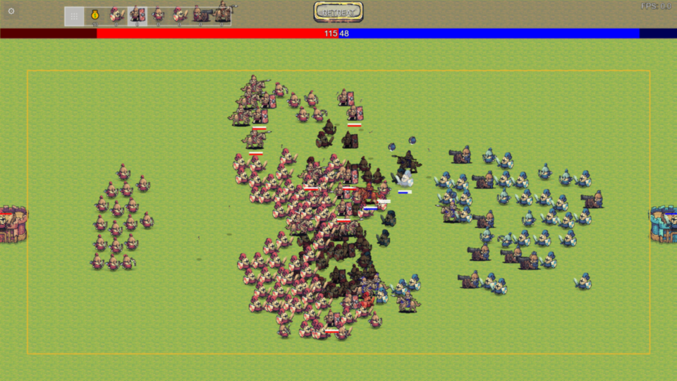
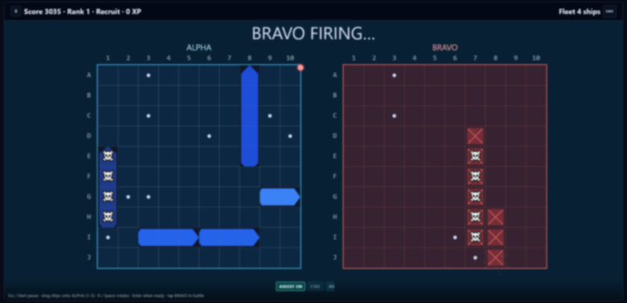

## Web games

<a href="https://santiherranz.itch.io/" target="_blank">santiherranz.itch.io</a>

<!--
  Game grid: newest first (left → right, top → bottom). Each row is two columns.
  To add a game, insert its <td> in date order or add a new <tr> with two cells.
  Thumbnails: every game  uses the same inline style (fixed height + object-fit: cover)
  so screenshots with different aspect ratios still align in the two-column layout.
  Each <td> uses matching vertical padding so rows breathe between game pairs.
-->
<table>
<tr>
<td width="50%" valign="top" align="center" style="padding:22px 12px;">

<h4 align="center" style="margin:0.25em 0;font-size:1.45em;line-height:1.2;">Battle Commander with LittleJS</h4>

 

<a href="https://santiherranz.itch.io/battle-commander-with-littlejs" target="_blank"><b>Preview on itch.io</b></a> — no public access

2026 · <a href="https://github.com/KilledByAPixel/LittleJS" target="_blank">LittleJS</a> · <a href="https://pixelfrog-assets.itch.io/tiny-swords" target="_blank">Tiny Swords</a>

</td>
<td width="50%" valign="top" align="center" style="padding:22px 12px;">

<h4 align="center" style="margin:0.25em 0;font-size:1.45em;line-height:1.2;">Classic Battleship with AI assist</h4>

 

<a href="https://santiherranz.itch.io/online-battleship" target="_blank"><b>Play on itch.io</b></a>

2026 · itch.io

</td>
</tr>
<tr>
<td width="50%" valign="top" align="center" style="padding:22px 12px;">

<h4 align="center" style="margin:0.25em 0;font-size:1.45em;line-height:1.2;">Rockets and Drones: Firefighter</h4>

 

<a href="https://santiherranz.itch.io/rockets-and-drones-firefighter" target="_blank"><b>Play on itch.io</b></a>

2026 · itch.io

</td>
<td width="50%" valign="top" align="center" style="padding:22px 12px;">

<h4 align="center" style="margin:0.25em 0;font-size:1.45em;line-height:1.2;">Battle Commander — Colyseus</h4>

 

<a href="https://github.com/santiHerranz/canvas-colyseus-template" target="_blank"><b>Source on GitHub</b></a> · <a href="https://canvas-colyseus-template-production.up.railway.app/" target="_blank"><b>Play live demo</b></a>

2026 · Colyseus · <a href="https://railway.app" target="_blank">Railway</a>

</td>
</tr>
<tr>
<td width="50%" valign="top" align="center" style="padding:22px 12px;">

<h4 align="center" style="margin:0.25em 0;font-size:1.45em;line-height:1.2;">Rockfall Command</h4>

 

<a href="https://santiherranz.itch.io/rockfall-command" target="_blank"><b>Play on itch.io</b></a> 

2025–2026 · browser

</td>
<td width="50%" valign="top" align="center" style="padding:22px 12px;">

<h4 align="center" style="margin:0.25em 0;font-size:1.45em;line-height:1.2;">Battle commander — Middle ages</h4>

 

<a href="https://js13kgames.com/games/battle-commander-middle-ages/index.html" target="_blank"><b>Play the game</b></a>

2023 <a href="https://js13kgames.com/2023/games" target="_blank">JS13K</a> — 13th century theme

</td>
</tr>
<tr>
<td width="50%" valign="top" align="center" style="padding:22px 12px;">

<h4 align="center" style="margin:0.25em 0;font-size:1.45em;line-height:1.2;">SumoFighters</h4>

 

<a href="https://santiherranz.github.io/SumoFighters/" target="_blank"><b>Play in the browser</b></a>

2021 · robot sumo simulator

</td>
<td width="50%" valign="top" align="center" style="padding:22px 12px;">

<h4 align="center" style="margin:0.25em 0;font-size:1.45em;line-height:1.2;">Rocket Cargo</h4>

 

<a href="https://santiherranz.github.io/RocketCargo/" target="_blank"><b>Play in the browser</b></a>

2021 <a href="https://js13kgames.com/2021/games" target="_blank">JS13K</a> - Space 

</td>
</tr>
</table>

  <a href="https://github.com/santiHerranz?tab=repositories&q=&type=public">View all on GitHub →</a>

